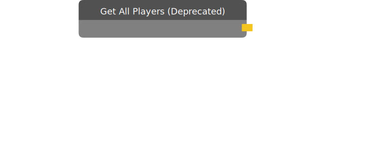

# Get All Players (Deprecated)

Outputs a list of all the players in the room currently.

:::danger DEPRECATED

This chip has been deprecated. Please move to a different chip.

:::

| Input Name | Input Type |
|-----------|-----------|

| Output Name | Output Type |
|-----------|-----------|
| Players | List[player] |

  
Properties

  

    

    <table>
      <thead>
        <tr>
          <th>Is beta required?</th>
          <th>❌</th>
        </tr>
        <tr>
          <th>Is this chip a trolling risk?</th>
          <th>❌</th>
        </tr>
        <tr>
          <th>Chip UUID</th>
          <th>09b0bf5b-95df-474b-b81a-4e8e2c78ed0a</th>
        </tr>
      </thead>
    </table>
    

  

### Uses

None so far!

### Tips

None so far!

### Issues

None so far!