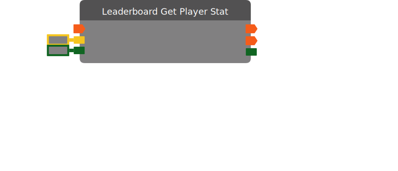

# Leaderboard Get Player Stat

Get leaderboard stat for the given player on stat channel 1, 2 or 3.

| Input Name | Input Type |
|-----------|-----------|
| Run | exec |
| Player | player |
| Channel | int |

| Output Name | Output Type |
|-----------|-----------|
| Run | exec |
| On Get Stat Complete | exec |
| Value | int |

  
Properties

  

    

    <table>
      <thead>
        <tr>
          <th>Is beta required?</th>
          <th>❌</th>
        </tr>
        <tr>
          <th>Is this chip a trolling risk?</th>
          <th>❌</th>
        </tr>
        <tr>
          <th>Chip UUID</th>
          <th>12cf9781-1e1b-4e59-a783-c7214b66be8a</th>
        </tr>
      </thead>
    </table>
    

  

### Uses

None so far!

### Tips

None so far!

### Issues

None so far!