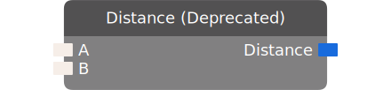

# Distance (Deprecated)

Outputs the distance between the input objects.

:::danger DEPRECATED

This chip has been deprecated. Please move to a different chip.

:::

| Input Name | Input Type |
|-----------|-----------|
| A | Union(ai , combatant , rec room object , player , vector3) |
| B | Union(ai , combatant , rec room object , player , vector3) |

| Output Name | Output Type |
|-----------|-----------|
| Distance | float |

  
Properties

  

    

    <table>
      <thead>
        <tr>
          <th>Is beta required?</th>
          <th>❌</th>
        </tr>
        <tr>
          <th>Is this chip a trolling risk?</th>
          <th>❌</th>
        </tr>
        <tr>
          <th>Chip UUID</th>
          <th>182e1ae2-1183-4741-af6e-f307b788a857</th>
        </tr>
      </thead>
    </table>
    

  

### Uses

None so far!

### Tips

None so far!

### Issues

None so far!