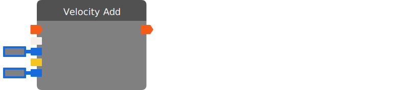

# Velocity Add

Adds velocity to the input target. The input velocity will be multiplied by the magnitude of the vector provided in the input direction.

| Input Name | Input Type |
|-----------|-----------|
| Add Velocity | exec |
| Target | Union(player , rec room object) |
| Speed (m/s) | float |
| Direction | vector3 |
| Maximum Speed (m/s) | float |

| Output Name | Output Type |
|-----------|-----------|
| *No name.* | exec |

  
Properties

  

    

    <table>
      <thead>
        <tr>
          <th>Is beta required?</th>
          <th>❌</th>
        </tr>
        <tr>
          <th>Is this chip a trolling risk?</th>
          <th>❌</th>
        </tr>
        <tr>
          <th>Chip UUPD</th>
          <th>._uuid</th>
        </tr>
      </thead>
    </table>
    

  

### Uses

None so far!

### Tips

None so far!

### Issues

None so far!