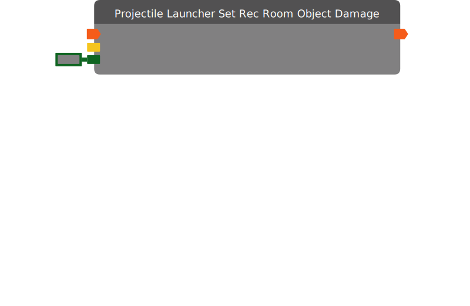

# Projectile Launcher Set Rec Room Object Damage

Sets the damage value that projectiles from the target launcher will do when hitting Rec Room Objects.

:::caution BETA

This chip requires beta content to be enabled in the room. You can access the setting in "This Room -> Settings".

:::

| Input Name | Input Type |
|-----------|-----------|
| *No name.* | exec |
| Target | projectile launcher |
| Damage | int |

| Output Name | Output Type |
|-----------|-----------|
| *No name.* | exec |

  
Properties

  

    

    <table>
      <thead>
        <tr>
          <th>Is beta required?</th>
          <th>✅</th>
        </tr>
        <tr>
          <th>Is this chip a trolling risk?</th>
          <th>❌</th>
        </tr>
        <tr>
          <th>Chip UUID</th>
          <th>1fcd6f83-b403-426d-8ded-7064e8790b2d</th>
        </tr>
      </thead>
    </table>
    

  

### Uses

None so far!

### Tips

None so far!

### Issues

None so far!