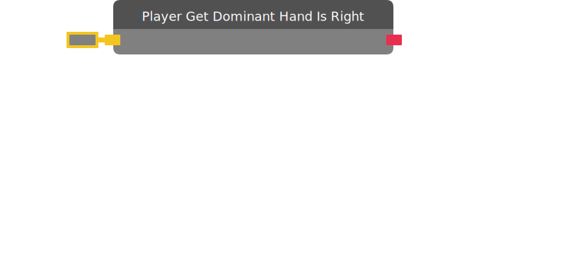

# Player Get Dominant Hand Is Right

Returns true if the given player has their right hand set as dominant.

| Input Name | Input Type |
|-----------|-----------|
| Player | player |

| Output Name | Output Type |
|-----------|-----------|
| Result | bool |

  
Properties

  

    

    <table>
      <thead>
        <tr>
          <th>Is beta required?</th>
          <th>❌</th>
        </tr>
        <tr>
          <th>Is this chip a trolling risk?</th>
          <th>❌</th>
        </tr>
        <tr>
          <th>Chip UUID</th>
          <th>2cc92be4-ca23-4148-88d6-71cfb9b7fd58</th>
        </tr>
      </thead>
    </table>
    

  

### Uses

None so far!

### Tips

None so far!

### Issues

None so far!