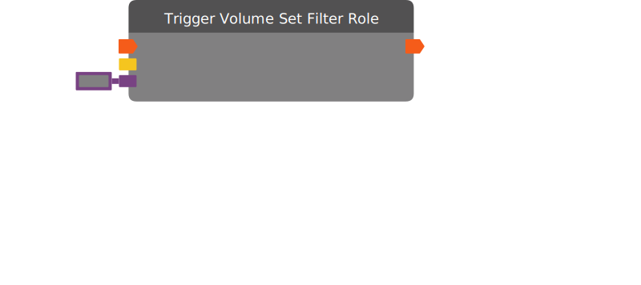

# Trigger Volume Set Filter Role

Sets the role name that is being used as a filter for a Trigger Volume.

| Input Name | Input Type |
|-----------|-----------|
| *No name.* | exec |
| Target | trigger volume |
| Value | string |

| Output Name | Output Type |
|-----------|-----------|
| *No name.* | exec |

  
Properties

  

    

    <table>
      <thead>
        <tr>
          <th>Is beta required?</th>
          <th>❌</th>
        </tr>
        <tr>
          <th>Is this chip a trolling risk?</th>
          <th>❌</th>
        </tr>
        <tr>
          <th>Chip UUID</th>
          <th>55cfecf9-2623-4aad-948c-6ca89f11911b</th>
        </tr>
      </thead>
    </table>
    

  

### Uses

None so far!

### Tips

None so far!

### Issues

None so far!