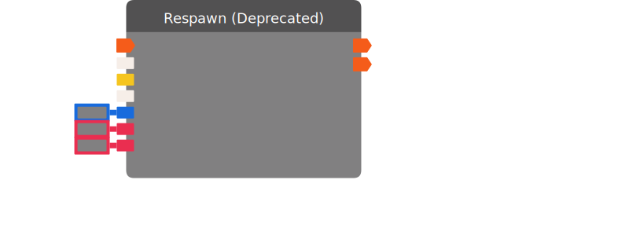

# Respawn (Deprecated)

Sets the position and rotation of the target player or object. Players will rotate about the vertical axis only. Will fail in the following cases: If the target object is currently held, selected/frozen by the maker pen, or is the child of a gizmo. Will also fail on players that are seated.

:::danger DEPRECATED

This chip has been deprecated. Please move to a different chip.

:::

| Input Name | Input Type |
|-----------|-----------|
| *No name.* | exec |
| Target | Union(player , rec room object) |
| Position | vector3 |
| Rotation | Union(vector3 , quaternion) |
| Spawn Radius | float |
| Clear Velocity | bool |
| Use Rez Effects | bool |

| Output Name | Output Type |
|-----------|-----------|
| *No name.* | exec |
| Failed | exec |

  
Properties

  

    

    <table>
      <thead>
        <tr>
          <th>Is beta required?</th>
          <th>❌</th>
        </tr>
        <tr>
          <th>Is this chip a trolling risk?</th>
          <th>❌</th>
        </tr>
        <tr>
          <th>Chip UUPD</th>
          <th>._uuid</th>
        </tr>
      </thead>
    </table>
    

  

### Uses

None so far!

### Tips

None so far!

### Issues

None so far!