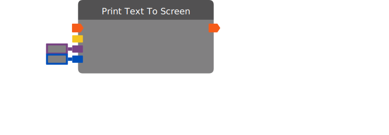

# Print Text To Screen

*No description.*

| Input Name | Input Type |
|-----------|-----------|
| *No name.* | exec |
| Target | text screen |
| Text | string |
| Color | color |

| Output Name | Output Type |
|-----------|-----------|
| *No name.* | exec |

  
Properties

  

    

    <table>
      <thead>
        <tr>
          <th>Is beta required?</th>
          <th>❌</th>
        </tr>
        <tr>
          <th>Is this chip a trolling risk?</th>
          <th>❌</th>
        </tr>
        <tr>
          <th>Chip UUID</th>
          <th>5f9f8c85-8aaa-4c9d-9d9d-4c952053b623</th>
        </tr>
      </thead>
    </table>
    

  

### Uses

None so far!

### Tips

None so far!

### Issues

None so far!