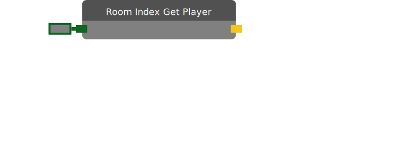

# Room Index Get Player

Returns the player in the room with this unique index, bounded by the room capacity.

| Input Name | Input Type |
|-----------|-----------|
| Room Index | int |

| Output Name | Output Type |
|-----------|-----------|
| Player | player |

  
Properties

  

    

    <table>
      <thead>
        <tr>
          <th>Is beta required?</th>
          <th>❌</th>
        </tr>
        <tr>
          <th>Is this chip a trolling risk?</th>
          <th>❌</th>
        </tr>
        <tr>
          <th>Chip UUPD</th>
          <th>._uuid</th>
        </tr>
      </thead>
    </table>
    

  

### Uses

None so far!

### Tips

None so far!

### Issues

None so far!