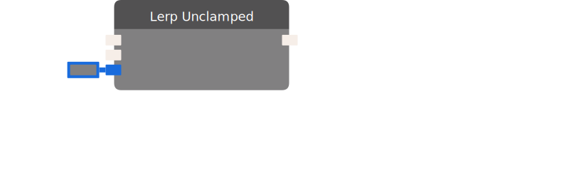

# Lerp Unclamped

Computes a linear interpolation. The interpolant is not clamped. When lerping between Colors, the interpolant is still constrained to values which stay within the set of real colors.

:::caution BETA

This chip requires beta content to be enabled in the room. You can access the setting in "This Room -> Settings".

:::

| Input Name | Input Type |
|-----------|-----------|
| Start | Union(float , quaternion , vector3 , color) |
| End | Union(float , quaternion , vector3 , color) |
| Progress | float |

| Output Name | Output Type |
|-----------|-----------|
| Result | Union(float , quaternion , vector3 , color) |

  
Properties

  

    

    <table>
      <thead>
        <tr>
          <th>Is beta required?</th>
          <th>✅</th>
        </tr>
        <tr>
          <th>Is this chip a trolling risk?</th>
          <th>❌</th>
        </tr>
        <tr>
          <th>Chip UUPD</th>
          <th>._uuid</th>
        </tr>
      </thead>
    </table>
    

  

### Uses

None so far!

### Tips

None so far!

### Issues

None so far!