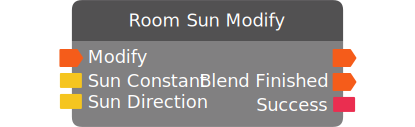

# Room Sun Modify

*No description.*

| Input Name | Input Type |
|-----------|-----------|
| Modify | exec |
| Sun Constant | sun |
| Sun Direction | sun direction |

| Output Name | Output Type |
|-----------|-----------|
| *No name.* | exec |
| Blend Finished | exec |
| Success | bool |

  
Properties

  

    

    <table>
      <thead>
        <tr>
          <th>Is beta required?</th>
          <th>❌</th>
        </tr>
        <tr>
          <th>Is this chip a trolling risk?</th>
          <th>❌</th>
        </tr>
        <tr>
          <th>Chip UUPD</th>
          <th>._uuid</th>
        </tr>
      </thead>
    </table>
    

  

### Uses

None so far!

### Tips

None so far!

### Issues

None so far!