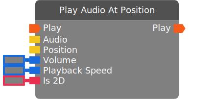

# Play Audio At Position

*No description.*

:::caution BETA

This chip requires beta content to be enabled in the room. You can access the setting in "This Room -> Settings".

:::

| Input Name | Input Type |
|-----------|-----------|
| Play | exec |
| Audio | audio |
| Position | vector3 |
| Volume | float |
| Playback Speed | float |
| Is 2D | bool |

| Output Name | Output Type |
|-----------|-----------|
| Play | exec |

  
Properties

  

    

    <table>
      <thead>
        <tr>
          <th>Is beta required?</th>
          <th>✅</th>
        </tr>
        <tr>
          <th>Is this chip a trolling risk?</th>
          <th>❌</th>
        </tr>
        <tr>
          <th>Chip UUPD</th>
          <th>._uuid</th>
        </tr>
      </thead>
    </table>
    

  

### Uses

None so far!

### Tips

None so far!

### Issues

None so far!