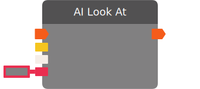

# AI Look At

Command an AI to look at the input target. If you want the AI to look in a passed in vector as a direction, set the “Look Target Is Direction” parameter to True. To make an AI stop looking, use the AI Stop Looking node.

:::caution BETA

This chip requires beta content to be enabled in the room. You can access the setting in "This Room -> Settings".

:::

| Input Name | Input Type |
|-----------|-----------|
| *No name.* | exec |
| AI | ai |
| Look Target | Union(ai , combatant , rec room object , patrol point , player , vector3) |
| Look Target is Direction | bool |

| Output Name | Output Type |
|-----------|-----------|
| *No name.* | exec |

  
Properties

  

    

    <table>
      <thead>
        <tr>
          <th>Is beta required?</th>
          <th>✅</th>
        </tr>
        <tr>
          <th>Is this chip a trolling risk?</th>
          <th>❌</th>
        </tr>
        <tr>
          <th>Chip UUPD</th>
          <th>._uuid</th>
        </tr>
      </thead>
    </table>
    

  

### Uses

None so far!

### Tips

None so far!

### Issues

None so far!