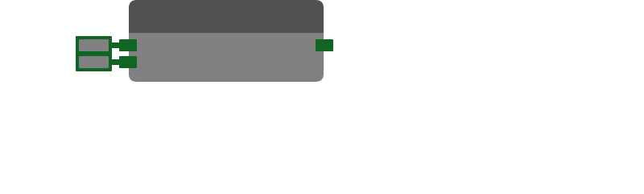

# Bit Rotate Right

Rotates digits in the binary representation of an integer to the right. As the rightmost bits fall off, they are used to fill the leftmost bits.

| Input Name | Input Type |
|-----------|-----------|
| Value | int |
| Shift | int |

| Output Name | Output Type |
|-----------|-----------|
| Result | int |

  
Properties

  

    

    <table>
      <thead>
        <tr>
          <th>Is beta required?</th>
          <th>❌</th>
        </tr>
        <tr>
          <th>Is this chip a trolling risk?</th>
          <th>❌</th>
        </tr>
        <tr>
          <th>Chip UUPD</th>
          <th>._uuid</th>
        </tr>
      </thead>
    </table>
    

  

### Uses

None so far!

### Tips

None so far!

### Issues

None so far!