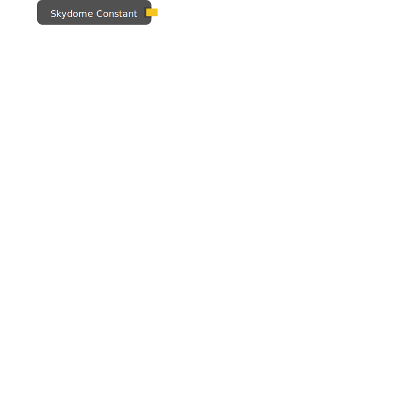

# Skydome Constant

Defines values for the room skydome.

| Input Name | Input Type |
|-----------|-----------|

| Output Name | Output Type |
|-----------|-----------|
| *No name.* | skydome |

  
Properties

  

    

    <table>
      <thead>
        <tr>
          <th>Is beta required?</th>
          <th>❌</th>
        </tr>
        <tr>
          <th>Is this chip a trolling risk?</th>
          <th>❌</th>
        </tr>
        <tr>
          <th>Chip UUID</th>
          <th>bff88a1e-4888-4e03-a1f4-804864a2f177</th>
        </tr>
      </thead>
    </table>
    

  

### Uses

None so far!

### Tips

None so far!

### Issues

None so far!