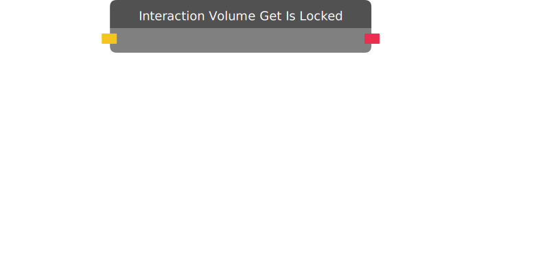

# Interaction Volume Get Is Locked

Returns False if the Interaction Volume is enabled, and True if it is locked.

| Input Name | Input Type |
|-----------|-----------|
| Target | interaction volume |

| Output Name | Output Type |
|-----------|-----------|
| Is Locked | bool |

  
Properties

  

    

    <table>
      <thead>
        <tr>
          <th>Is beta required?</th>
          <th>❌</th>
        </tr>
        <tr>
          <th>Is this chip a trolling risk?</th>
          <th>❌</th>
        </tr>
        <tr>
          <th>Chip UUPD</th>
          <th>._uuid</th>
        </tr>
      </thead>
    </table>
    

  

### Uses

None so far!

### Tips

None so far!

### Issues

None so far!