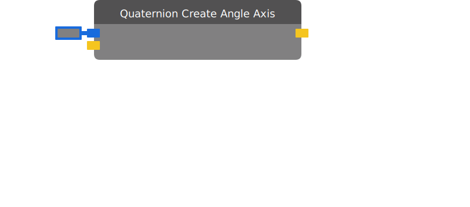

# Quaternion Create Angle Axis

Creates a rotation which rotates "Angle" degrees around "Axis".

| Input Name | Input Type |
|-----------|-----------|
| Angle | float |
| Axis | vector3 |

| Output Name | Output Type |
|-----------|-----------|
| Result | quaternion |

  
Properties

  

    

    <table>
      <thead>
        <tr>
          <th>Is beta required?</th>
          <th>❌</th>
        </tr>
        <tr>
          <th>Is this chip a trolling risk?</th>
          <th>❌</th>
        </tr>
        <tr>
          <th>Chip UUID</th>
          <th>d9096fb3-50c6-42f9-93bb-fc6df63d86a8</th>
        </tr>
      </thead>
    </table>
    

  

### Uses

None so far!

### Tips

None so far!

### Issues

None so far!