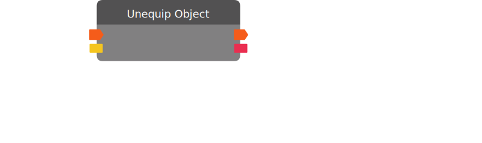

# Unequip Object

*No description.*

| Input Name | Input Type |
|-----------|-----------|
| *No name.* | exec |
| Object | rec room object |

| Output Name | Output Type |
|-----------|-----------|
| *No name.* | exec |
| Success | bool |

  
Properties

  

    

    <table>
      <thead>
        <tr>
          <th>Is beta required?</th>
          <th>❌</th>
        </tr>
        <tr>
          <th>Is this chip a trolling risk?</th>
          <th>❌</th>
        </tr>
        <tr>
          <th>Chip UUID</th>
          <th>df6cdb0c-24d7-447d-b29b-3979e51fb865</th>
        </tr>
      </thead>
    </table>
    

  

### Uses

None so far!

### Tips

None so far!

### Issues

None so far!