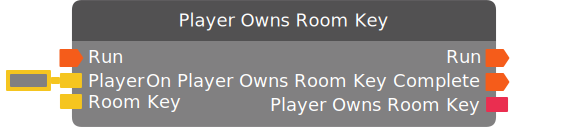

# Player Owns Room Key

*No description.*

| Input Name | Input Type |
|-----------|-----------|
| Run | exec |
| Player | player |
| Room Key | room key |

| Output Name | Output Type |
|-----------|-----------|
| Run | exec |
| On Player Owns Room Key Complete | exec |
| Player Owns Room Key | bool |

  
Properties

  

    

    <table>
      <thead>
        <tr>
          <th>Is beta required?</th>
          <th>❌</th>
        </tr>
        <tr>
          <th>Is this chip a trolling risk?</th>
          <th>❌</th>
        </tr>
        <tr>
          <th>Chip UUID</th>
          <th>e61558a9-0ce4-4dba-ac87-b16e61bcdb23</th>
        </tr>
      </thead>
    </table>
    

  

### Uses

None so far!

### Tips

None so far!

### Issues

None so far!