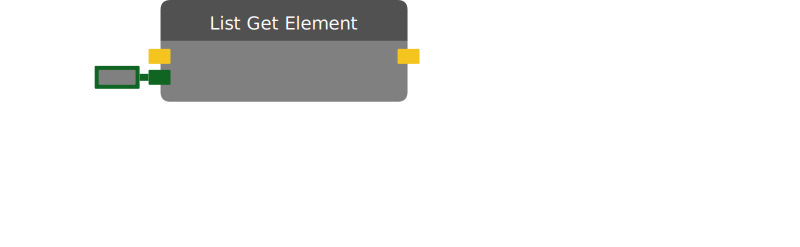

# List Get Element

Gets a specified element from the input list. The "Index" is the location of the element in the list. The first element in the list is at index 0, the second element is at index 1.

| Input Name | Input Type |
|-----------|-----------|
| List | List[any] |
| Index | int |

| Output Name | Output Type |
|-----------|-----------|
| Value | any |

  
Properties

  

    

    <table>
      <thead>
        <tr>
          <th>Is beta required?</th>
          <th>❌</th>
        </tr>
        <tr>
          <th>Is this chip a trolling risk?</th>
          <th>❌</th>
        </tr>
        <tr>
          <th>Chip UUID</th>
          <th>e8c5082f-0a75-4025-9679-293bc8d72989</th>
        </tr>
      </thead>
    </table>
    

  

### Uses

None so far!

### Tips

None so far!

### Issues

None so far!