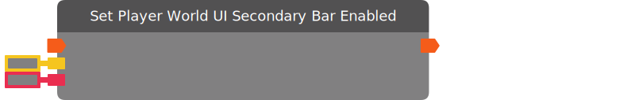

# Set Player World UI Secondary Bar Enabled

Set the enabled state of the secondary bar in the given player's active world UI.

| Input Name | Input Type |
|-----------|-----------|
| *No name.* | exec |
| Player | player |
| Enabled | bool |

| Output Name | Output Type |
|-----------|-----------|
| *No name.* | exec |

  
Properties

  

    

    <table>
      <thead>
        <tr>
          <th>Is beta required?</th>
          <th>❌</th>
        </tr>
        <tr>
          <th>Is this chip a trolling risk?</th>
          <th>❌</th>
        </tr>
        <tr>
          <th>Chip UUID</th>
          <th>fce830ef-b17c-4564-a74d-c819b0fedcf7</th>
        </tr>
      </thead>
    </table>
    

  

### Uses

None so far!

### Tips

None so far!

### Issues

None so far!